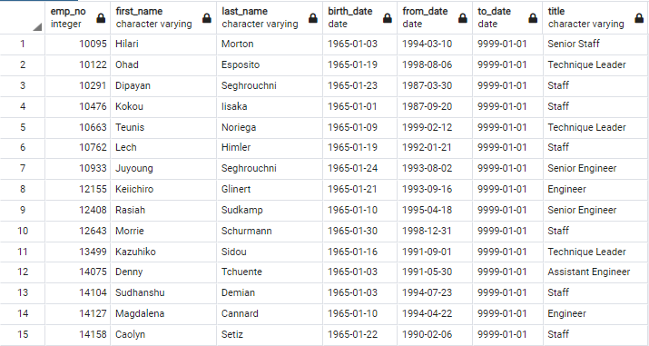

# Pewlett-Hackard-Analysis
Module 7

## Overview of the Analysis
Pewlett Hackard is a large legacy company with a massive workforce. They have experienced decades of growth, and have experienced lower than normal employee turnover in that time. As their workforce ages, it is becoming more apparent that they are on the precipice of a "Silver Tsunami" of retirement decisions. This will negatively impact the company as positions will be emptied faster than they can be filled, made worse by the fact that their longest-tenured employees are the most likely to hold management positions or positions of unique skill. 

To find a way to evaluate the magnitude of the potential retiring pool of employees, we were provided six data files that presented data on employees, their titles, departments, birthdays, hire dates, salaries, position dates, and many additional data points. Data from these six data files was merged and analyzed using a unique employee ID number as a primary key (and utilizing department number to link this information to department names). The following is a diagram of the entity relationship diagram (ERD) noting the relationships between the six CSV files:


- **The objective of Deliverable 1 was to create a table that presents the present titles of employees likely to retire, as well as the counts for each of these titles.**
- **The objective of Deliverable 2 was to create a table of employees eligible to participate in a mentorship program.**

## Results
- From the output created for Deliverable 1, we see that there are 90,398 employees at retirement age.
- We also see that the majority (68.8%) of the titles for the employees eligible for retirement contain the word "Senior", "Leader", or "Manager". This demonstrates the urgency in addressing these potential job openings, both from a hiring perspective and from a knowledge retention perspective.

**Unique Job Titles and Employee Counts**


- From the output created for Deliverable 2, we see that there are 1,549 employees who are eligible to participate in the mentorship program. 
- We also see a higher proportion of the mentorship eligible employee pool possess leadership roles when compared to all employees. This is to be expected given their senior status, and extra effort and incentive should be provided to confirm their participation in the program. 

**Employees Eligible for the Mentorship Program**


## Summary
In summary, we see that there are 90,398 employees born between 1952 and 1955 who are expected to imminently retire from Pewlett Hackard, and that more than 2/3 of those hold some leadership position. That is a very large number, but needs to be understood in the context of the entire employee count for the company. The following query can be run to develop a table summarizing unique employee IDs for current employees that can be used to get the overall count for the company:
```
-- Develop table to count all active employees
SELECT DISTINCT ON (employees.emp_no) employees.emp_no,
    employees.first_name,
    employees.last_name,
    titles.title,
    titles.from_date,
    titles.to_date
INTO all_employees
FROM employees
LEFT JOIN titles
ON employees.emp_no = titles.emp_no
ORDER BY employees.emp_no, titles.to_date DESC
```
Then, the following line of code can be run to find the count of active employees"
```
SELECT COUNT (emp_no)
FROM all_employees
```
We find that there are 300,024 active employees at Pewlett Hackard. The cohort of employees likely to retire makes up 30.1% of the company's workforce. Tsunami is an accurate description of this impending wave of retirements, particularly when most of these employees hold a position of leadership in the company. 

When we see that there are only 1,549 employees eligible for the mentorship program to fill 90,398 positions it would require that each mentor take on almost SIXTY mentees apiece to fill all the potentially opening positions. This is untenable. One quick solution would be to open up the age eligibility for potential mentors. By performing a very simple refactoring of the Deliverable 2 output code, we can create a larger eligible mentor employee pool. I would propose opening up the program to all employees born between 1960 and 1969. The following is how the relevant snippet of code would look with the updated year range:
```
WHERE (de.to_date = '9999-01-01')
	 AND (e.birth_date BETWEEN '1960-01-01' AND '1969-12-31')
```
We find the expanded mentor program would have 93,756 eligible mentors. That value, close to a 1-to-1 ratio to exiting employees, is much more realistic if we want to match employees as mentors and mentees before retirement requires promotion or additional hires. Great investment and incentivization should be placed into the mentor program if it is important to the company to maintain institutional expertise as such a large portion of the workforce retires in the near future.
